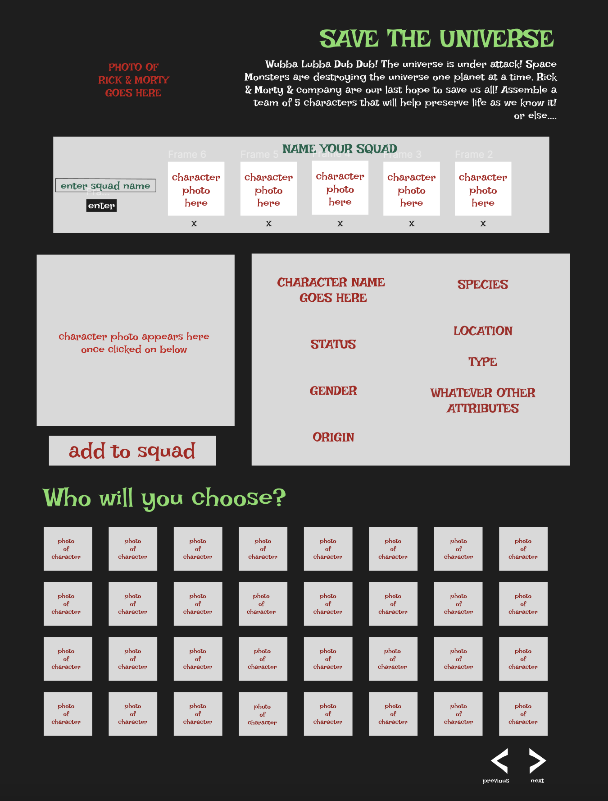
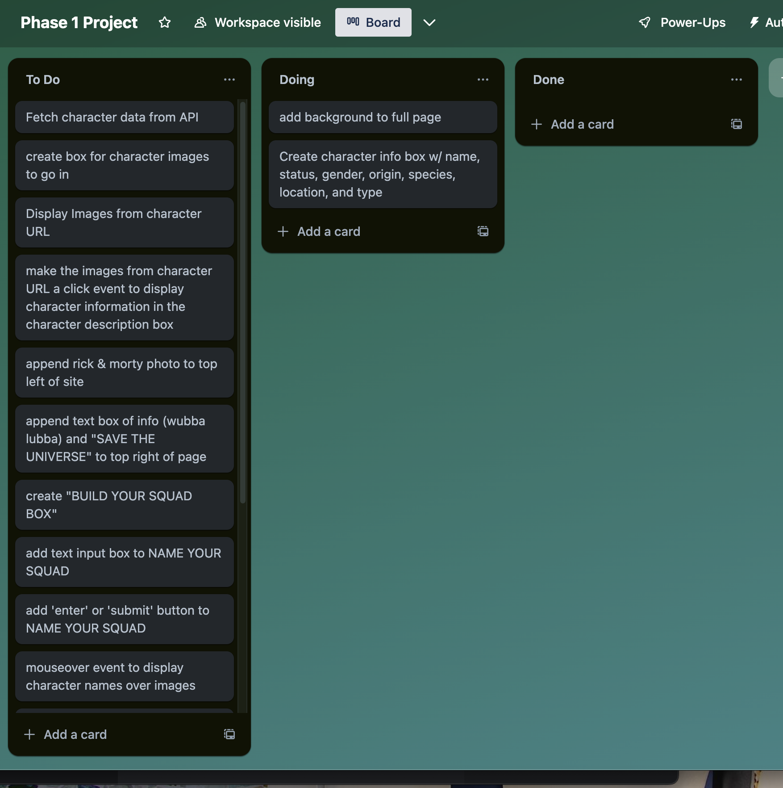

SAVE THE UNIVERSE is an app to assemble a team of Rick & Morty characters to save the universe from Space Monsters.

WIREFRAME/STYLE GUIDE:

credit: Figma

User story:
As a user, I can navigate through a character list and click a character to display information on the character. I can create a squad to 'save the universe' by entering my squad name and selecting enter. I can add characters to my squad by selecting "add to squad" once my character has been selected. I can remove the character by selecting the delete (X) button below each character in the build your squad box.
  
API: https://rickandmortyapi.com/api/character

Endpoints: https://rickandmortyapi.com/api/character/id

db.json example:
{
            "id": 1,
            "name": "Rick Sanchez",
            "status": "Alive",
            "species": "Human",
            "type": "",
            "gender": "Male",
            "origin": {
                "name": "Earth (C-137)",
            },
            "location": {
                "name": "Citadel of Ricks",
            },
            "image": "https://rickandmortyapi.com/api/character/avatar/1.jpeg",
            "url": "https://rickandmortyapi.com/api/character/1",
        },
        {
            "id": 2,
            "name": "Morty Smith",
            "status": "Alive",
            "species": "Human",
            "type": "",
            "gender": "Male",
            "origin": {
                "name": "unknown",
            },
            "location": {
                "name": "Citadel of Ricks",
            },
            "image": "https://rickandmortyapi.com/api/character/avatar/2.jpeg",
            "url": "https://rickandmortyapi.com/api/character/2",
        },
        {
            "id": 3,
            "name": "Summer Smith",
            "status": "Alive",
            "species": "Human",
            "type": "",
            "gender": "Female",
            "origin": {
                "name": "Earth (Replacement Dimension)",
            },
            "location": {
                "name": "Earth (Replacement Dimension)",
            },
            "image": "https://rickandmortyapi.com/api/character/avatar/3.jpeg",
            "url": "https://rickandmortyapi.com/api/character/3",
        },
    

Our 3 Event Listeners:
"click" - clicking a character displays character attributes in description box
"submit"- giving your squad a name by entering name and clicking enter button
"mouseover"- mouseover the character thumbnail to see name 

Array iteration:
For each- will be using to display images
For each- mouseover event 
for each- to display character information in the character info box
map- to construct a list of previously assigned squads (stretch deliv)

Deliverables:
1. User will select a character to to view details in character detail box ("click")
2. User will Mouseover img of character to view name ("mouseover")
3. User will add characters to the squad box to assemble a team of 5
    - User will click the add to squad button (POST)
4. User will give squad a name by entering "name" in box and clicking enter button ("submit")
5. User will remove characters from team by clicking "X" (DELETE)

Stretch Deliverables:
1. Create a list of squads at the bottom to view squads you have assembled w/ corresponding squad name user has previously assigned
2. Scroll to page 2 of characters below the group of photos of characters
3. Search box to search a character by name
4. Entering a new squad name to update squad name (PATCH)

Kanban Board: 

credit: Trello